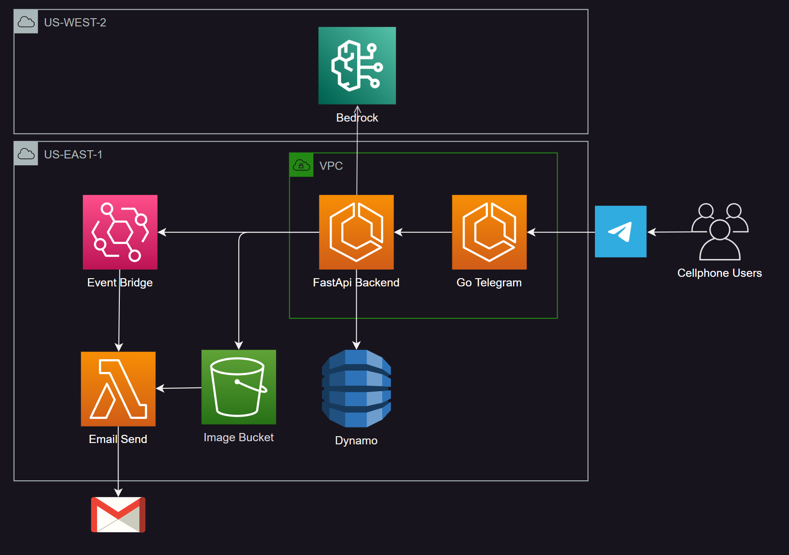

# AWS Cloud Software Project

## Project Description
This project involves a microservice application which includes a telegram bot, which connects the user to a llm model that can access a database and provide information to the user. The project is deployed on AWS.

